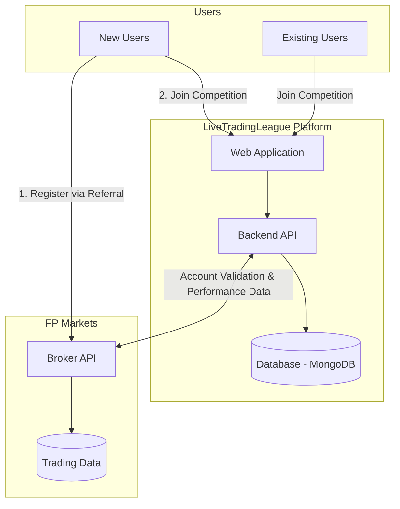
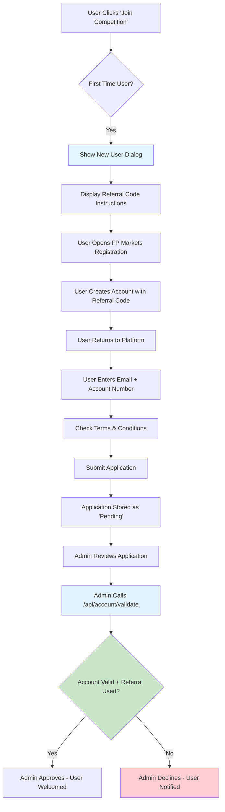
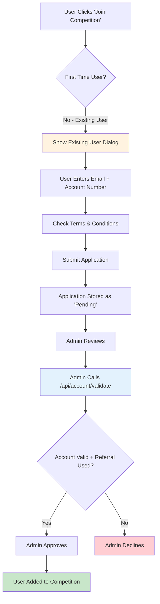

# LiveTradingLeague - Broker Integration & Platform Documentation

Official documentation for the LiveTradingLeague platform, specifically tailored for broker partners (FP Markets) and external stakeholders. This guide outlines the system architecture, user flows, and technical requirements for integration.

## 📜 Document History

| Version | Date | Description | Link |
|:---|:---|:---|:---|
| **v1.2** | 2026-02-05 | **Current Version** - Final Broker Integration Requirements | [View Requirements v1.2](https://github.com/livetradingcoder/trade-cmp/blob/main/.docs/REQUIREMENTS_BROKER_INTEGRATION_v1.2.md) |
| **v1.1** | 2026-01-28 | Initial Broker Integration Draft | [View Requirements v1.1](https://github.com/livetradingcoder/trade-cmp/blob/main/.docs/REQUIREMENTS_BROKER_INTEGRATION_v1.1.md) |
| **v1.0** | 2026-01-15 | Project Inception & Initial Scoping | - |

---

## 🏗️ System Architecture

High-level overview of how the LiveTradingLeague platform interacts with the Broker API.



---

## 🔄 User Flows

### 1. New User Registration

Flow for users who do not yet have an FP Markets account.



### 2. Existing User Registration

Flow for users who already have an FP Markets account.



---

## 🔌 Broker API Requirements

We require the following endpoints to be exposed by the broker partner (FP Markets).

### 1. Account Validation

**Endpoint:** `POST /api/account/validate`

Validates that an account exists, is active, and was created using the correct referral code.

**Request:**
```json
{
  "account_number": "12345678",
  "email": "user@example.com",
  "referral_code": "AFFASAD"
}
```

**Expected Response:**
```json
{
  "valid": true,
  "account_number": "12345678",
  "email_match": true,
  "referral_code_used": true,
  "account_status": "active",
  "account_created_at": "2026-01-15T10:30:00Z",
  "account_type": "live",
  "account_balance": 15000.00,
  "user_info": {
    "first_name": "John",
    "last_name_masked": "S***"
  }
}
```

### 2. Performance Data

**Endpoint:** `POST /api/account/performance`

Retrieves trading performance metrics for a list of accounts to generate the competition leaderboard.

**Request:**
```json
{
  "account_numbers": ["12345678", "87654321"],
  "start_date": "2026-01-01T00:00:00Z",
  "end_date": "2026-01-31T23:59:59Z",
  "metrics": ["roi", "starting_balance", "current_balance"]
}
```

**Expected Response:**
```json
{
  "start_date": "2026-01-01T00:00:00Z",
  "end_date": "2026-01-31T23:59:59Z",
  "accounts": [
    {
      "account_number": "12345678",
      "user_info": {
        "first_name": "John",
        "last_name_masked": "S***"
      },
      "metrics": {
        "roi": 45.68,
        "starting_balance": 10000.00,
        "current_balance": 14567.89
      },
      "last_trade_at": "2026-01-30T14:22:00Z",
      "status": "active"
    }
  ]
}
```

---

## 💻 Local Development (For Developers)

Instructions for running this documentation site locally.

### Prerequisites
- Node.js 18+
- npm or yarn

### Setup

```bash
# Install dependencies
npm install

# Start development server
npm run docs:dev
```

Visit `http://localhost:5173` to view the documentation.

### Build

```bash
# Build static site
npm run docs:build

# Preview production build
npm run docs:preview
```
