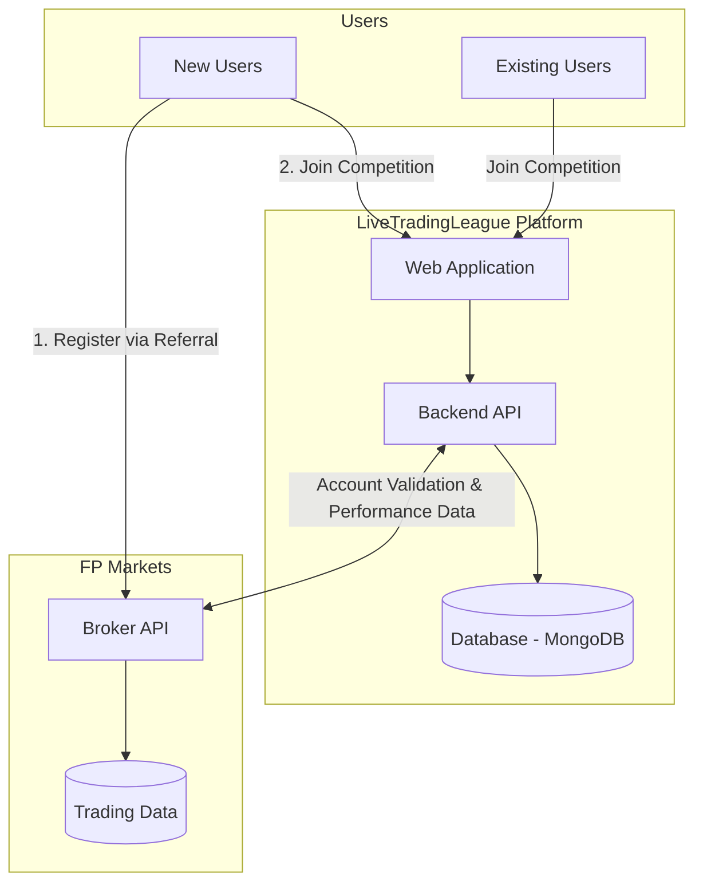
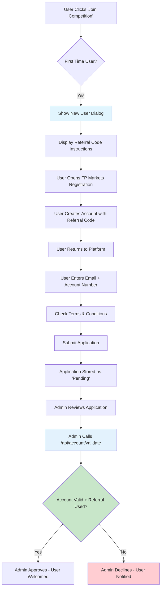
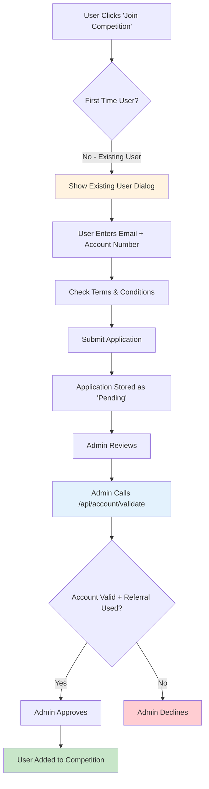

# LiveTradingLeague - Broker Integration & Platform Documentation

Official documentation for the LiveTradingLeague platform, specifically tailored for broker partners (FP Markets) and external stakeholders. This guide outlines the system architecture, user flows, and technical requirements for integration.

**Full docs site (build of this repo):** https://livetradingcoder.github.io/trade-cmp-docs/

## 📜 Document History

| Version | Date | Description | Link |
|:---|:---|:---|:---|
| **v1.1 (app)** | 2026-06 | Live FP Markets integration built, deployed, and under live testing | [FP Markets Sync guide](https://livetradingcoder.github.io/trade-cmp-docs/guide/fp-markets-sync) |
| **v1.2** | 2026-02-05 | Final Broker Integration Requirements (original ask, pre-delivery) | [View Requirements v1.2](https://github.com/livetradingcoder/trade-cmp/blob/main/.docs/REQUIREMENTS_BROKER_INTEGRATION_v1.2.md) |
| **v1.1** | 2026-01-28 | Initial Broker Integration Draft | [View Requirements v1.1](https://github.com/livetradingcoder/trade-cmp/blob/main/.docs/REQUIREMENTS_BROKER_INTEGRATION_v1.1.md) |
| **v1.0** | 2026-01-15 | Project Inception & Initial Scoping | - |

---

## 🔴 Current Integration & Test Status

FP Markets delivered their **Account Performance API** (`POST /api/account/performance`
on `https://ibbeta.fptrading.com`) — a different shape than the original draft
spec below (see [FP Markets Sync](https://livetradingcoder.github.io/trade-cmp-docs/guide/fp-markets-sync)
for the real, implemented contract). We built and deployed against it; the
sections below this one describe our **original ask**, kept for historical
context, not what's currently live.

**Live status as of the last check:**

| Check | Result |
|-------|--------|
| Our static outbound IP whitelisted by broker | ✅ |
| Auth (token + timestamp + HMAC-SHA256 signature) | ✅ verified live |
| Rebate/IB account `477779` accepted | ✅ |
| Accounts returned for our IB | ⚠️ **1 of 2 expected** — FP's own IB client portal shows 2 approved clients under `477779`; the Account Performance API returns only 1. Reported to FP as a broker-side gap. |
| Usable balance/trade data | ⚠️ Not yet — the 1 returned account has $0 balance and no trade activity |

Full live-test log: `.planning/STATE.md` in the [trade-cmp](https://github.com/livetradingcoder/trade-cmp) repo.
Once FP resolves the account mapping and adds real activity, the next step is a
full sync run to validate the leaderboard pipeline end to end — see
[FP Markets Sync → Verifying the Integration](https://livetradingcoder.github.io/trade-cmp-docs/guide/fp-markets-sync#verifying-the-integration).

---

## 🏗️ System Architecture

High-level overview of how the LiveTradingLeague platform interacts with the Broker API.


```mermaid
flowchart TB
    subgraph "LiveTradingLeague Platform"
        WEB[Web Application]
        API[Backend API]
        DB[(Database - MongoDB)]
    end

    subgraph "FP Markets"
        BROKER_API[Broker API]
        BROKER_DB[(Trading Data)]
    end

    subgraph "Users"
        NEW[New Users]
        EXISTING[Existing Users]
    end

    NEW -->|1. Register via Referral| BROKER_API
    NEW -->|2. Join Competition| WEB
    EXISTING -->|Join Competition| WEB
    WEB --> API
    API --> DB
    API <-->|Account Validation & Performance Data| BROKER_API
    BROKER_API --> BROKER_DB
```

---

## 🔄 User Flows

### 1. New User Registration

Flow for users who do not yet have an FP Markets account.


```mermaid
flowchart TD
    A[User Clicks 'Join Competition'] --> B{First Time User?}
    B -->|Yes| C[Show New User Dialog]
    C --> D[Display Referral Code Instructions]
    D --> E[User Opens FP Markets Registration]
    E --> F[User Creates Account with Referral Code]
    F --> G[User Returns to Platform]
    G --> H[User Enters Email + Account Number]
    H --> I[Check Terms & Conditions]
    I --> J[Submit Application]
    J --> K[Application Stored as 'Pending']
    K --> L[Admin Reviews Application]
    L --> M[Admin Calls /api/account/validate]
    M --> N{Account Valid + Referral Used?}
    N -->|Yes| O[Admin Approves - User Welcomed]
    N -->|No| P[Admin Declines - User Notified]

    style C fill:#e1f5fe
    style M fill:#e3f2fd
    style N fill:#c8e6c9
    style P fill:#ffcdd2
```

### 2. Existing User Registration

Flow for users who already have an FP Markets account.


```mermaid
flowchart TD
    A[User Clicks 'Join Competition'] --> B{First Time User?}
    B -->|No - Existing User| C[Show Existing User Dialog]
    C --> D[User Enters Email + Account Number]
    D --> E[Check Terms & Conditions]
    E --> F[Submit Application]
    F --> G[Application Stored as 'Pending']
    G --> H[Admin Reviews]
    H --> I[Admin Calls /api/account/validate]
    I --> J{Account Valid + Referral Used?}
    J -->|Yes| K[Admin Approves]
    J -->|No| L[Admin Declines]
    K --> M[User Added to Competition]

    style C fill:#fff3e0
    style I fill:#e3f2fd
    style M fill:#c8e6c9
    style L fill:#ffcdd2
```

---

## 🔌 Broker API — Original Requirements (Historical Draft)

::: warning Superseded by the delivered API
This section documents what we originally **asked** FP Markets for. What they
**actually built and delivered** — the endpoint we integrated and deployed
against — is documented in
[FP Markets Sync](https://livetradingcoder.github.io/trade-cmp-docs/guide/fp-markets-sync).
Field names, auth, and response shape differ from the draft below.
:::

We required the following endpoints to be exposed by the broker partner (FP Markets).

### 1. Account Validation

**Endpoint:** `POST /api/account/validate`

Validates that an account exists, is active, and was created using the correct referral code.

**Request:**
```json
{
  "account_number": "12345678",
  "email": "user@example.com",
  "referral_code": "AFFASAD"
}
```

**Expected Response:**
```json
{
  "valid": true,
  "account_number": "12345678",
  "email_match": true,
  "referral_code_used": true,
  "account_status": "active",
  "account_created_at": "2026-01-15T10:30:00Z",
  "account_type": "live",
  "account_balance": 15000.00,
  "user_info": {
    "first_name": "John",
    "last_name_masked": "S***"
  }
}
```

### 2. Performance Data (draft — see FP Markets Sync for what was actually delivered)

**Endpoint:** `POST /api/account/performance`

Retrieves trading performance metrics for a list of accounts to generate the competition leaderboard.

**Request:**
```json
{
  "account_numbers": ["12345678", "87654321"],
  "start_date": "2026-01-01T00:00:00Z",
  "end_date": "2026-01-31T23:59:59Z",
  "metrics": ["roi", "starting_balance", "current_balance"]
}
```

**Expected Response:**
```json
{
  "start_date": "2026-01-01T00:00:00Z",
  "end_date": "2026-01-31T23:59:59Z",
  "accounts": [
    {
      "account_number": "12345678",
      "user_info": {
        "first_name": "John",
        "last_name_masked": "S***"
      },
      "metrics": {
        "roi": 45.68,
        "starting_balance": 10000.00,
        "current_balance": 14567.89
      },
      "last_trade_at": "2026-01-30T14:22:00Z",
      "status": "active"
    }
  ]
}
```

---

## 💻 Local Development (For Developers)

Instructions for running this documentation site locally.

### Prerequisites
- Node.js 20+
- npm or yarn

### Setup

```bash
# Install dependencies
npm install

# Start development server
npm run docs:dev
```

Visit `http://localhost:5173` to view the documentation.

### Build

```bash
# Build static site
npm run docs:build

# Preview production build
npm run docs:preview
```

Pushing to `main` auto-deploys to GitHub Pages via `.github/workflows/deploy.yml`.
