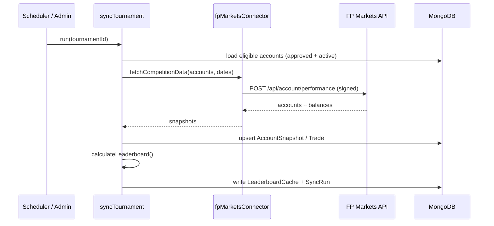

# Data Flow

## Frontend → API

```
[React Component]
   → useTournaments() / context
   → fetch() to /api/*   (same-origin; nginx proxies to backend)
   → Express routes
   → Mongoose models
   → MongoDB
```

## Broker Sync → Leaderboard

The leaderboard is **not** computed on request — it is produced by a sync job
(scheduled or admin-triggered) and read from a cache.



Reading the leaderboard (`GET /api/leaderboard/:tournamentId`) just returns the
latest `LeaderboardCache` for the tournament (15-min TTL). See
[FP Markets Sync](/guide/fp-markets-sync).

## Authentication

1. Admin logs in → `POST /api/admin/login`
2. Server returns a JWT (7-day validity)
3. Frontend stores it and sends `Authorization: Bearer <token>`
4. `verifyToken` middleware guards protected routes

## Outbound (to the broker)

All calls to FP Markets leave through Railway's **static egress IP(s)** (the
ones the broker whitelists) over IPv4. See
[Railway Deployment](/deployment/railway#static-egress-ip).
