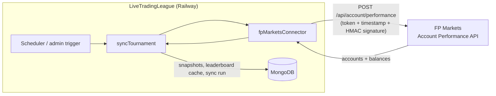

# FP Markets Sync

**Status:** ✅ Built & deployed — pending broker IP whitelist for the live proof.

This page documents the **real** FP Markets integration: the signed connector that
calls the broker's Account Performance API, the sync service that turns broker
data into leaderboard rankings, and the endpoints that drive it.

> The earlier mock endpoints (`/api/broker/*`) are superseded by this connector.
> See [Broker Integration](/guide/broker-integration) for the original mock design.

---

## Overview



The platform **calls** the broker (outbound). The broker whitelists our static
egress IP(s) — see [Railway Deployment](/deployment/railway#static-egress-ip).

---

## The Connector

`packages/server/src/services/brokers/fpMarketsConnector.ts` implements the
shared `BrokerConnector` interface (alongside `fixture` and `simulation`).

### Authentication

Every request carries three headers:

| Header | Value |
|--------|-------|
| `token` | API token from the broker |
| `timestamp` | current Unix timestamp (seconds) |
| `signature` | `HMAC-SHA256(timestamp, secret)` as lowercase hex |

```ts
const timestamp = String(Math.floor(Date.now() / 1000));
const signature = crypto
  .createHmac("sha256", secret)
  .update(timestamp)
  .digest("hex");
```

### Request

The API is keyed by **rebate/IB account numbers** and returns the trading
accounts mapped under them. The connector sends the configured rebate
number(s); responses are matched back to participant accounts.

```json
POST /api/account/performance
{
  "account_numbers": ["00123", "00456"],
  "start_date": "2026-01-01",
  "end_date": "2026-06-30"
}
```

### Mapping

The API returns `starting_balance`, `current_balance`, `last_trade_at` and a
status — but **no raw trades**, and `roi` is reserved (always `0`). So the
connector emits **two balance snapshots** per account (starting + current) and
lets `calculateLeaderboard` derive ROI from the equity change.

| Connector capability | Value | Reason |
|----------------------|-------|--------|
| `supportsSnapshots` | `true` | starting/current balance |
| `supportsRawTrades` | `false` | API returns no trades |
| `supportsBrokerMetrics` | `false` | `roi` is reserved/always 0 |

### Account status values

| Value | Meaning |
|-------|---------|
| `active` | status 1, 2, or 4 |
| `funding` | status 3 |
| `inactive` | status 5 (dormant) |
| `closed` | status 6 |
| `unknown` | unrecognised |

---

## The Sync Service

`packages/server/src/services/sync/syncTournament.ts` orchestrates a sync:

1. Load **eligible** trading accounts (status `active`, participant `approved`).
2. Group by broker integration; resolve the connector by type.
3. Call `fetchCompetitionData(...)` with the tournament date window.
4. Upsert `AccountSnapshot` (idempotent on account + `captured_at`) and `Trade`.
5. `calculateLeaderboard(...)` → write `LeaderboardCache` (15-min TTL).
6. Record a `SyncRun` for audit (counts, status, errors).

A per-tournament failure (e.g. broker rejects our IP) is captured in the
`SyncRun.error_summary` and surfaced in the API response — other integrations
still process.

### Scheduler

`packages/server/src/services/sync/scheduler.ts` runs every active tournament on
an interval. **Disabled by default** — enable only after the broker has
whitelisted our IP:

```env
SYNC_ENABLED=true
SYNC_INTERVAL_MINUTES=60
```

---

## Endpoints

| Method | Endpoint | Auth | Purpose |
|--------|----------|------|---------|
| `POST` | `/api/admin/sync/:tournamentId` | admin | Trigger a sync now |
| `GET` | `/api/admin/fp-test` | admin | One live signed call — proves auth + signing + IP whitelist |
| `GET` | `/api/leaderboard/:tournamentId` | admin | Read computed rankings from `LeaderboardCache` |

### Verifying the integration

`GET /api/admin/fp-test` makes a single signed call using the configured rebate
account(s) and returns the raw broker response:

| Result | Meaning | Fix |
|--------|---------|-----|
| `200` + accounts | ✅ proven | — |
| `403` "IP not whitelisted" | broker hasn't whitelisted us | confirm IP with broker |
| `404` "Rebate account … not found" | auth + IP OK, wrong rebate number | fix `FP_MARKETS_REBATE_ACCOUNTS` |
| `401` "Unauthorized" | token/secret/signature wrong | recheck `FP_MARKETS_TOKEN/SECRET` |

---

## Configuration

```env
FP_MARKETS_BASE_URL=https://ibbeta.fptrading.com
FP_MARKETS_TOKEN=<api token from broker>
FP_MARKETS_SECRET=<secret from broker>
FP_MARKETS_REBATE_ACCOUNTS=00123,00456   # your IB/rebate number(s)
SYNC_ENABLED=false                        # true once IP whitelisted
SYNC_INTERVAL_MINUTES=60
```

See [Environment Variables](/deployment/environment) for the full reference.
