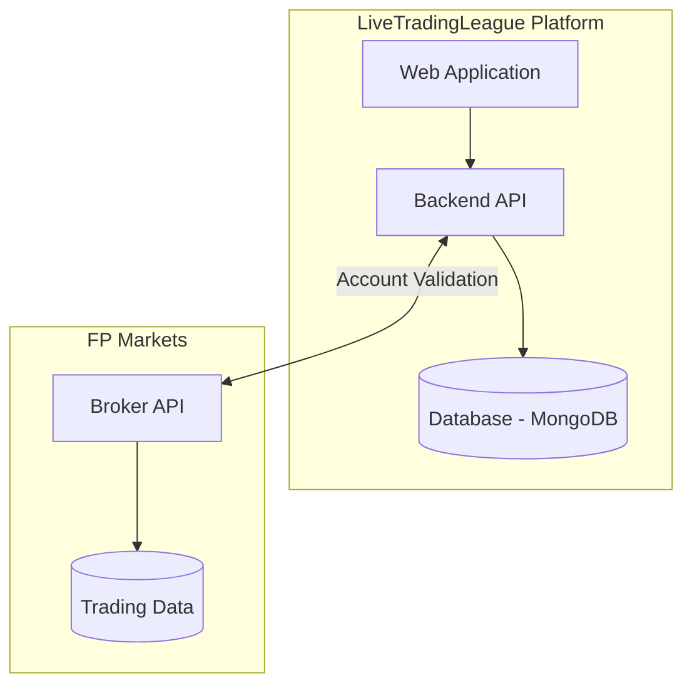

## 📜 Document History

| Version | Date | Description | Link |
|:---|:---|:---|:---|
| **v1.2** | 2026-02-05 | **Current Version** - Final Broker Integration Requirements | [View Requirements v1.2](/requirements/v1.2) |
| **v1.1** | 2026-01-28 | Initial Broker Integration Draft | [View Requirements v1.1](/requirements/v1.1) |
| **v1.0** | 2026-01-15 | Project Inception & Initial Scoping | - |

## 🏗️ System Architecture



## Quick Start

Get up and running in minutes:

```bash
# Clone the repository
git clone https://github.com/livetradingcoder/trade-cmp.git
cd trade-cmp

# Install dependencies
npm install

# Set up environment variables
cp .env.example .env

# Start development server
npm run dev
```

## Latest Updates

### Version 1.0.0 (February 2026)

- ✅ Complete broker integration with FP Markets
- ✅ User registration and participant management
- ✅ Admin dashboard with comprehensive controls
- ✅ Email notification system
- ✅ Real-time leaderboard tracking
- ✅ SMTP configuration management
- ✅ Production-ready Docker deployment

[View full changelog →](/changelog)

## Architecture Overview

LiveTradingLeague is built as a modern full-stack application:

- **Frontend**: React 19 + TypeScript + Vite
- **Backend**: Node.js + Express + MongoDB
- **Authentication**: JWT-based secure authentication
- **Deployment**: Docker + Docker Compose
- **Monorepo**: Turborepo for efficient builds

[Learn more about the architecture →](/guide/architecture)

## Community & Support

- 📖 [Documentation](/)
- 💬 [GitHub Discussions](https://github.com/livetradingcoder/trade-cmp/discussions)
- 🐛 [Issue Tracker](https://github.com/livetradingcoder/trade-cmp/issues)
- 📧 [Email Support](mailto:livetradingcoderlive-trading-league@proton.me)
