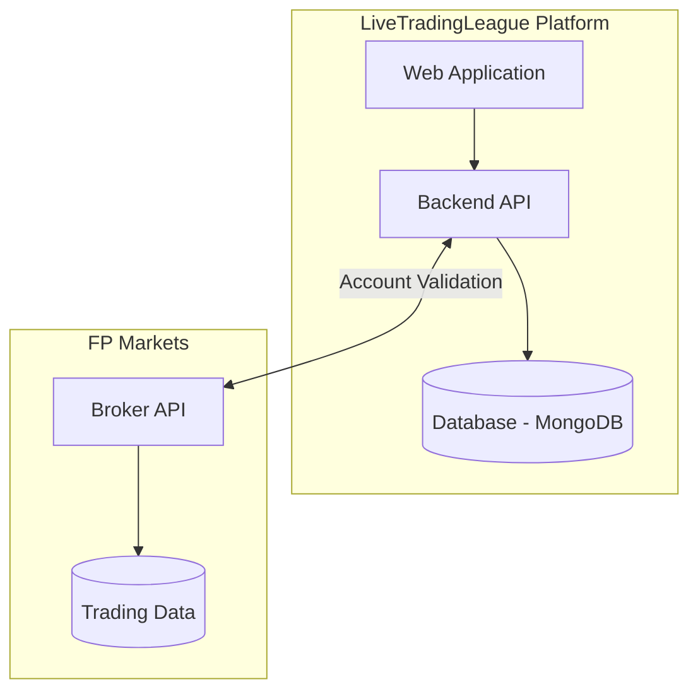

## 📜 Document History

| Version | Date | Description | Link |
|:---|:---|:---|:---|
| **v1.2** | 2026-02-05 | **Current Version** - Final Broker Integration Requirements | [View Requirements v1.2](/requirements/v1.2) |
| **v1.1** | 2026-01-28 | Initial Broker Integration Draft | [View Requirements v1.1](/requirements/v1.1) |
| **v1.0** | 2026-01-15 | Project Inception & Initial Scoping | - |

## 🏗️ System Architecture


```mermaid
flowchart TB
    subgraph "LiveTradingLeague Platform"
        WEB[Web Application]
        API[Backend API]
        DB[(Database - MongoDB)]
    end

    subgraph "FP Markets"
        BROKER_API[Broker API]
        BROKER_DB[(Trading Data)]
    end

    WEB --> API
    API --> DB
    API <-->|Account Validation| BROKER_API
    BROKER_API --> BROKER_DB
```

## Quick Start

Get up and running in minutes:

```bash
# Clone the repository
git clone https://github.com/livetradingcoder/trade-cmp.git
cd trade-cmp

# Install dependencies
npm install

# Set up environment variables
cp .env.example .env

# Start development server
npm run dev
```

## Latest Updates

### Version 1.1.0 (June 2026)

- ✅ Live FP Markets integration — signed connector + sync pipeline ([FP Markets Sync](/guide/fp-markets-sync))
- ✅ Leaderboard computed from broker data and served from cache
- ✅ Deployed on Railway (single container) with a **static egress IP** for the broker whitelist
- ✅ Custom domain via Cloudflare; resilient MongoDB connection (no crash-loop)

### Version 1.0.0 (February 2026)

- ✅ Broker integration scaffold with FP Markets (mock endpoints)
- ✅ User registration and participant management
- ✅ Admin dashboard, email notifications, SMTP configuration

[View full changelog →](/changelog)

## Architecture Overview

LiveTradingLeague is built as a modern full-stack application:

- **Frontend**: React 19 + TypeScript + Vite
- **Backend**: Node.js 22 + Express + MongoDB
- **Authentication**: JWT-based secure authentication
- **Deployment**: Railway single container (nginx + Express) — [details](/deployment/railway)
- **Monorepo**: Turborepo for efficient builds

[Learn more about the architecture →](/guide/architecture)

## Community & Support

- 📖 [Documentation](/)
- 💬 [GitHub Discussions](https://github.com/livetradingcoder/trade-cmp/discussions)
- 🐛 [Issue Tracker](https://github.com/livetradingcoder/trade-cmp/issues)
- 📧 [Email Support](mailto:live-trading-league@proton.me)
