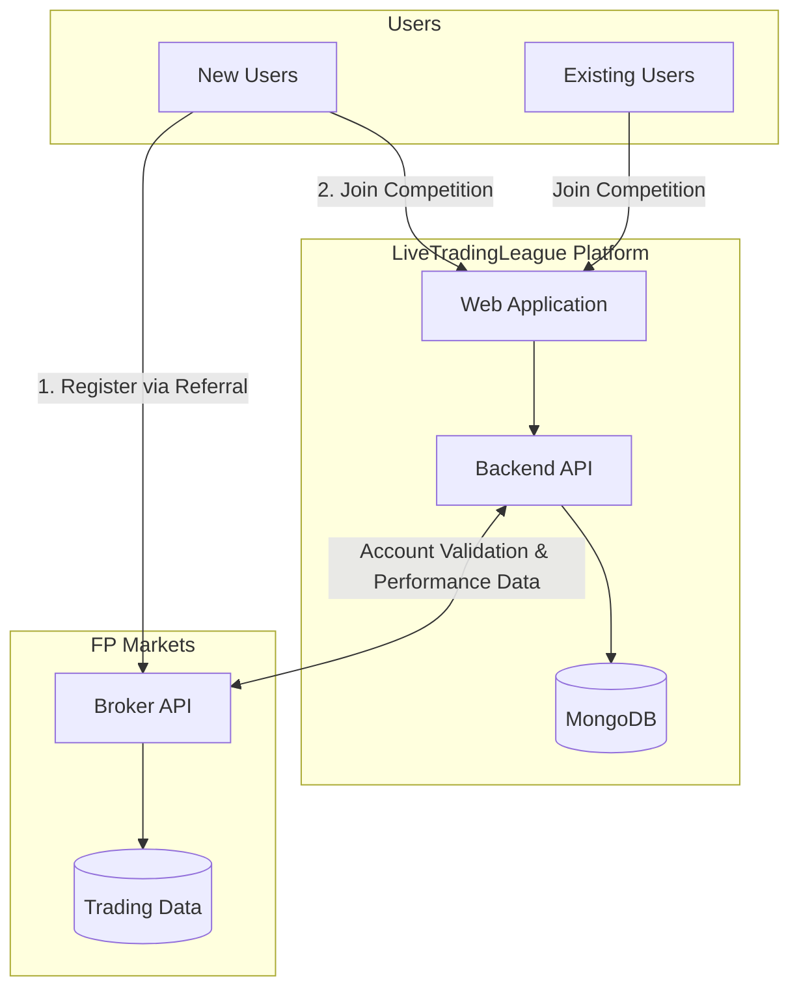
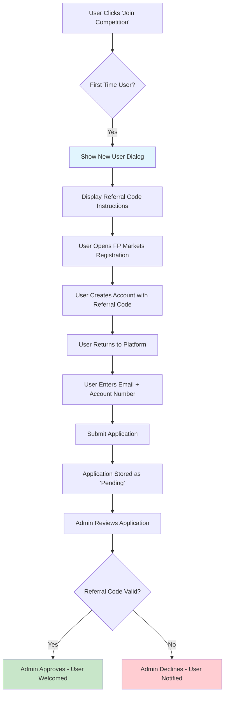
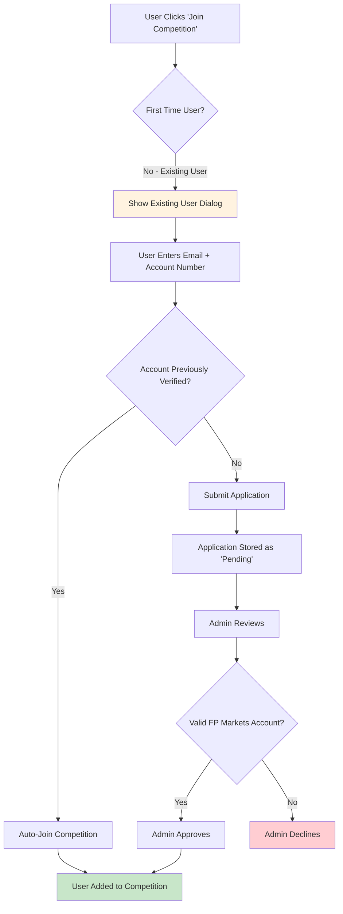
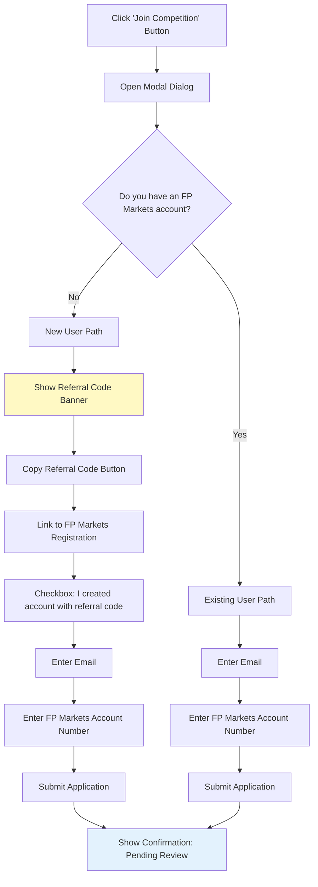
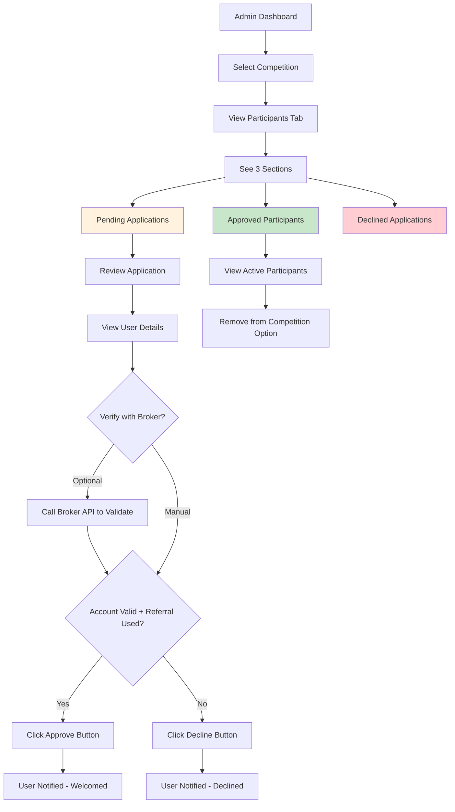
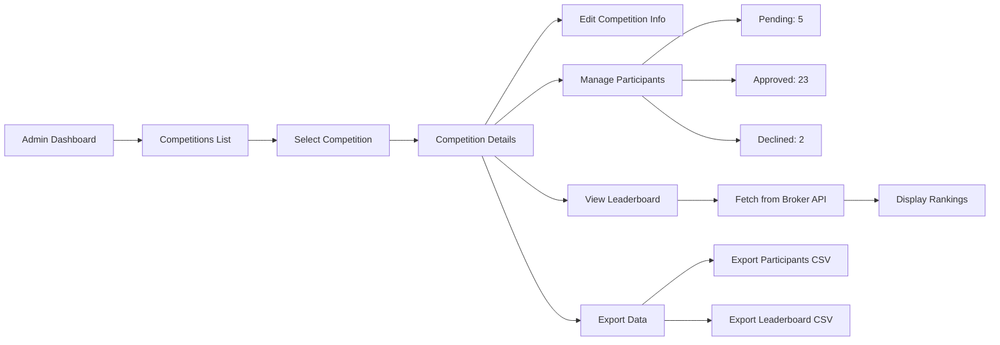
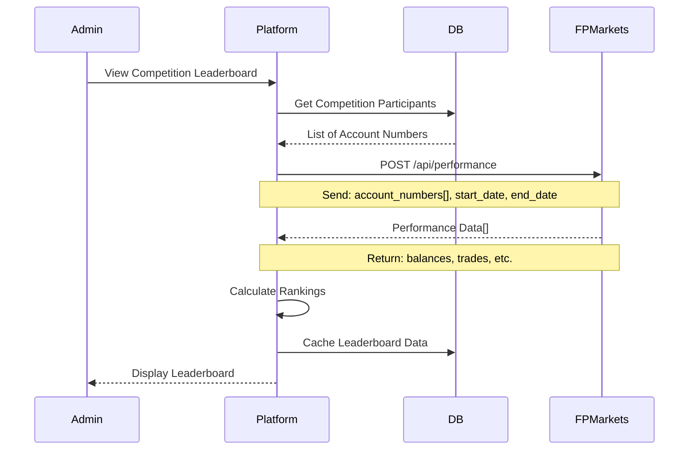
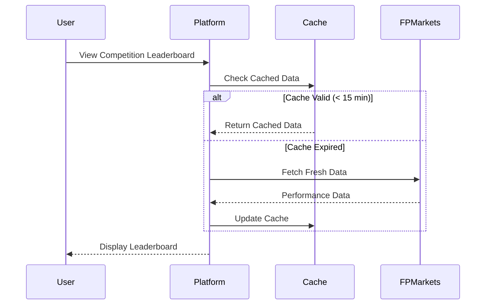
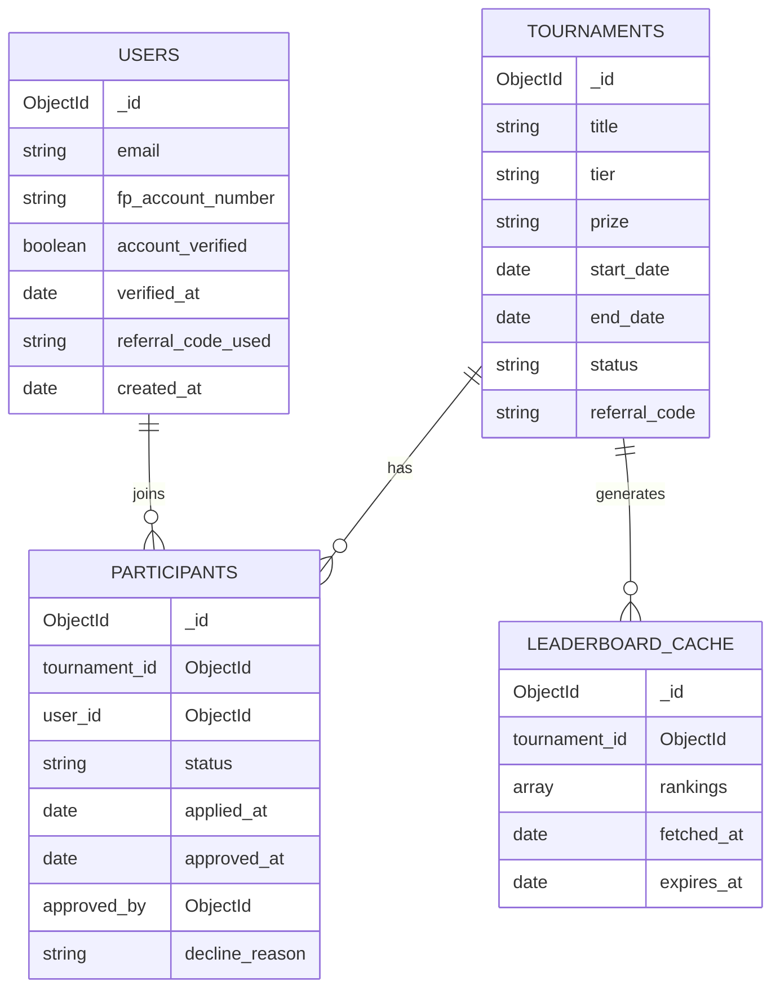
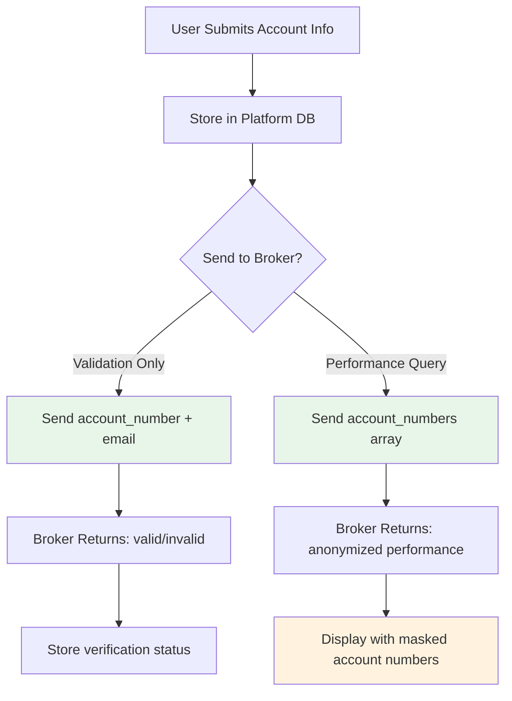

# LiveTradingLeague - Broker Integration & User Flow Requirements (v1.1)

## Document Info
- **Version:** 1.1
- **Date:** February 2026
- **Status:** Draft for Stakeholder Review
- **Broker Partner:** FP Markets

---

## 1. Executive Summary

This document outlines the technical requirements for integrating FP Markets broker data to power the LiveTradingLeague competition platform. It covers user registration flows, tournament participation, leaderboard data requirements, and admin management capabilities.

---

## 2. High-Level System Architecture



---

## 3. User Registration Flows

### 3.1 New User Flow



### 3.2 Existing User Flow



### 3.3 Join Competition Dialog Flow



---

## 4. Admin Management Flow

### 4.1 Managing Competition Participants



### 4.2 Admin Dashboard - Competition Management



---

## 5. Leaderboard Data Flow

### 5.1 Leaderboard Generation Flow



### 5.2 Public Leaderboard Display



---

## 6. Broker API Requirements

### 6.1 Required Endpoints from FP Markets

| Endpoint | Method | Purpose | Priority |
|----------|--------|---------|----------|
| `/api/account/validate` | POST | Validate account exists and referral code used | **Critical** |
| `/api/account/performance` | POST | Get trading performance for accounts | **Critical** |
| `/api/account/info` | GET | Get account metadata (creation date, status) | High |
| `/api/referral/verify` | POST | Verify specific referral code was used | High |

### 6.2 Account Validation Request

**Endpoint:** `POST /api/account/validate`

**Request:**
```json
{
  "account_number": "12345678",
  "email": "user@example.com",
  "referral_code": "AFFASAD"
}
```

**Expected Response:**
```json
{
  "valid": true,
  "account_number": "12345678",
  "email_match": true,
  "referral_code_used": true,
  "account_status": "active",
  "account_created_at": "2026-01-15T10:30:00Z",
  "account_type": "live"
}
```

### 6.3 Performance Data Request

**Endpoint:** `POST /api/account/performance`

**Request:**
```json
{
  "account_numbers": ["12345678", "87654321", "11223344"],
  "start_date": "2026-01-01T00:00:00Z",
  "end_date": "2026-01-31T23:59:59Z",
  "metrics": ["trades_count", "balance"]
}
```

**Expected Response:**
```json
{
  "competition_period": {
    "start": "2026-01-01T00:00:00Z",
    "end": "2026-01-31T23:59:59Z"
  },
  "accounts": [
    {
      "account_number": "12345678",
      "display_name": "Trader***78",
      "metrics": {
        "starting_balance": 10000.00,
        "current_balance": 14567.89,
        "trades_count": 127
      },
      "last_trade_at": "2026-01-30T14:22:00Z",
      "status": "active"
    }
  ]
}
```

### 6.4 Data Requirements Summary

| Data Field | Description | Used For |
|------------|-------------|----------|
| `account_number` | FP Markets account ID | User identification |
| `starting_balance` | Balance at competition start | Ranking calculation |
| `current_balance` | Current account balance | Ranking calculation & Display |
| `trades_count` | Number of trades | Activity verification |
| `last_trade_at` | Last trade timestamp | Activity check |
| `account_status` | Account status | Eligibility check |

---

## 7. Data Model Changes

### 7.1 New Collections Required



### 7.2 Users Collection Schema

```javascript
{
  _id: ObjectId,
  email: String,                    // User email
  fp_account_number: String,        // FP Markets account number
  display_name: String,             // Optional display name
  account_verified: Boolean,        // Verified with broker
  verified_at: Date,                // When verified
  referral_code_used: String,       // Which referral code used
  is_new_user: Boolean,             // First time on platform
  created_at: Date,
  updated_at: Date
}
```

### 7.3 Participants Collection Schema

```javascript
{
  _id: ObjectId,
  tournament_id: ObjectId,          // Reference to tournament
  user_id: ObjectId,                // Reference to user
  status: String,                   // 'pending' | 'approved' | 'declined'
  applied_at: Date,
  reviewed_at: Date,
  reviewed_by: ObjectId,            // Admin who reviewed
  decline_reason: String,           // If declined
  notes: String                     // Admin notes
}
```

### 7.4 Tournament Collection Updates

```javascript
// Add to existing tournament schema:
{
  // ... existing fields ...
  start_date: Date,                 // Competition start
  end_date: Date,                   // Competition end
  status: String,                   // 'upcoming' | 'active' | 'completed'
  max_participants: Number,         // Optional cap
  referral_code: String,            // Required referral for this competition
  leaderboard_public: Boolean       // Show to non-participants
}
```

---

## 8. Security & Privacy Considerations

### 8.1 Data Handling



### 8.2 Privacy Requirements

| Data | Storage | Display | Shared with Broker |
|------|---------|---------|-------------------|
| Email | Encrypted | Never public | For validation only |
| Account Number | Encrypted | Masked (****1234) | Yes |
| Performance Data | Cached | Public on leaderboard | N/A (from broker) |
| Referral Code | Plain | Admin only | For validation |

---

## 9. Implementation Phases

### Phase 1: User Registration (MVP)
- [ ] Join competition dialog (new/existing user paths)
- [ ] Users collection in MongoDB
- [ ] Participants collection with status tracking
- [ ] Basic admin participant management UI

### Phase 2: Admin Management
- [ ] Competition participant tabs (pending/approved/declined)
- [ ] Approve/decline buttons with notifications
- [ ] Participant export functionality
- [ ] Admin notes and tracking

### Phase 3: Broker Integration
- [ ] Account validation API integration
- [ ] Performance data API integration
- [ ] Leaderboard caching system
- [ ] Error handling and fallbacks

### Phase 4: Public Leaderboard
- [ ] Real-time leaderboard display
- [ ] Competition status indicators
- [ ] Historical competition results
- [ ] Winner announcements

---

## 10. Questions for FP Markets

### Technical Questions

1. **API Authentication:** What authentication method will be used? (API Key, OAuth, JWT)
2. **Rate Limits:** What are the rate limits for API calls?
3. **Data Freshness:** How often is performance data updated?
4. **Webhook Support:** Can you send webhooks for account events?
5. **Sandbox Environment:** Is a test/sandbox environment available?

### Data Questions

1. **Account Anonymization:** Can you provide masked account numbers for public display?
2. **Historical Data:** How far back can we query performance data?
3. **Real-time Data:** Is real-time balance data available or is there a delay?
4. **Referral Verification:** Can you confirm referral code usage programmatically?

### Business Questions

1. **Data Agreement:** What data sharing agreement is required?
2. **SLA:** What uptime/availability guarantees are provided?
3. **Support:** Who is the technical contact for integration issues?
