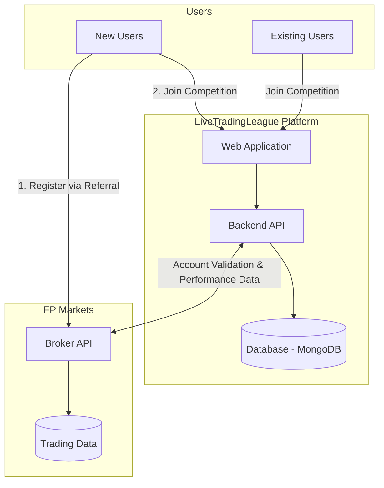
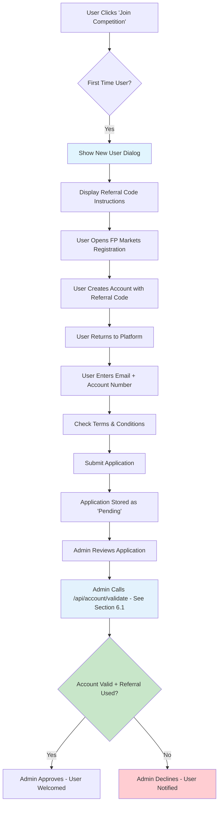
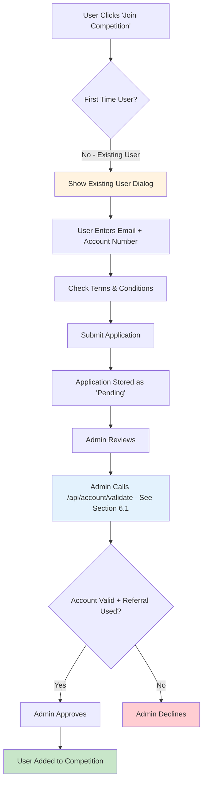
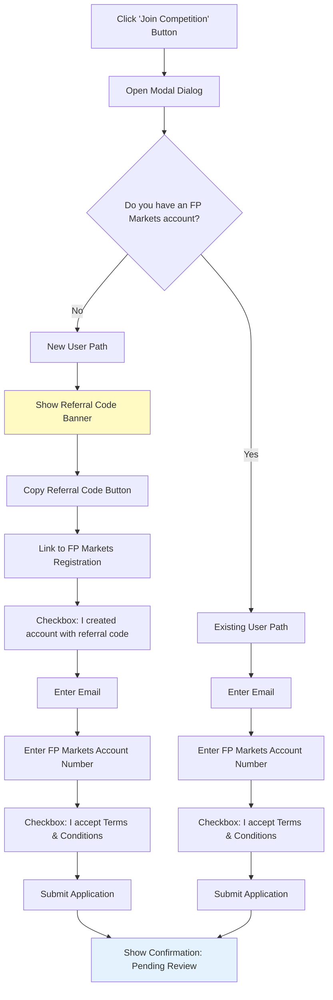
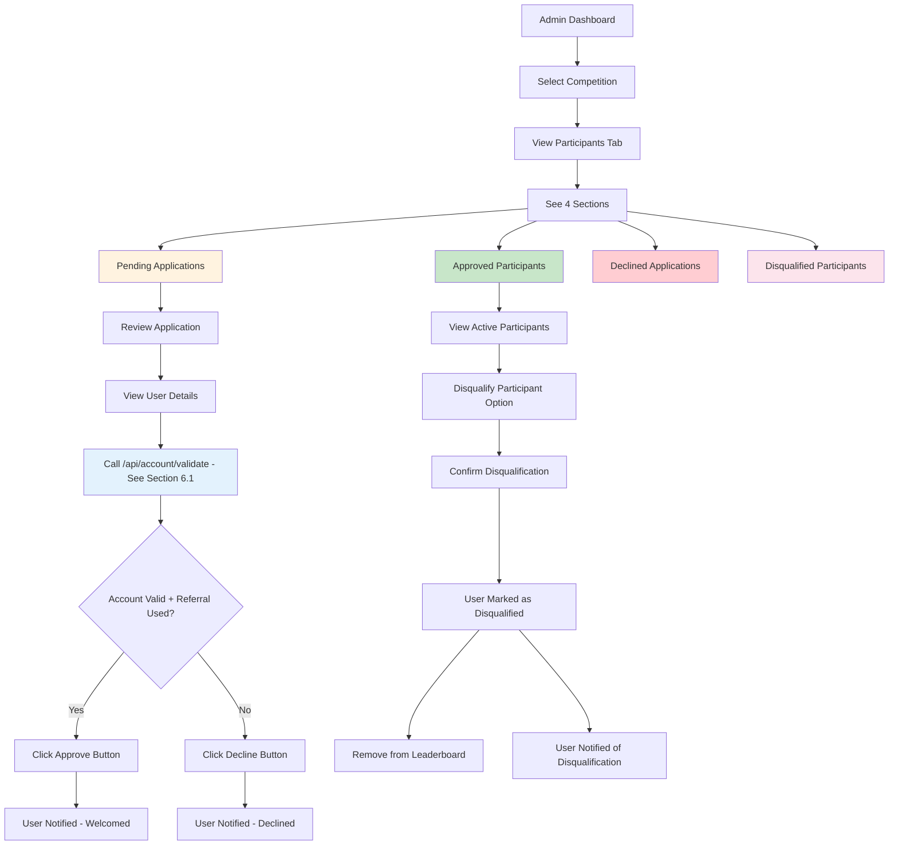
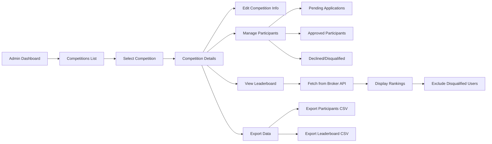
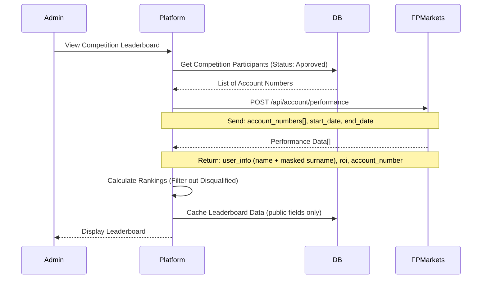
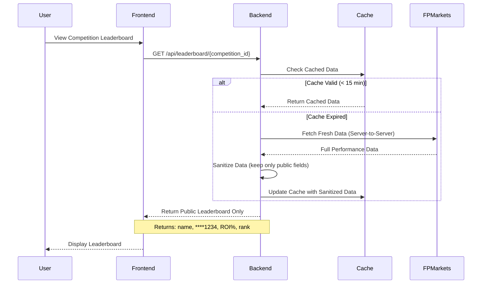
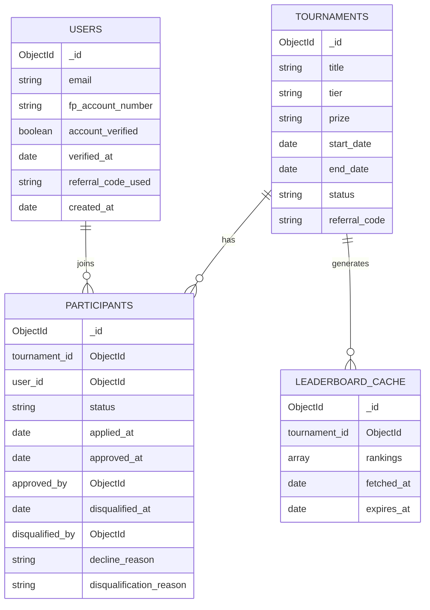
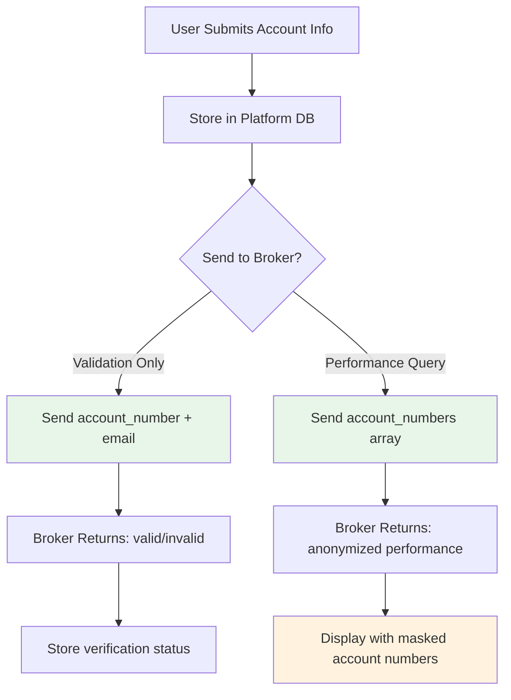

# LiveTradingLeague - Broker Integration & User Flow Requirements (v1.2)

## Document Info
- **Version:** 1.2
- **Date:** February 2026
- **Status:** Draft for Stakeholder Review
- **Broker Partner:** FP Markets

---

## 1. Executive Summary

This document outlines the technical requirements for integrating FP Markets broker data to power the LiveTradingLeague competition platform. It covers user registration flows, tournament participation, leaderboard data requirements, and admin management capabilities, including the ability to disqualify participants during a live competition.

---

## 2. High-Level System Architecture



---

## 3. User Registration Flows

### 3.1 New User Flow



### 3.2 Existing User Flow



### 3.3 Join Competition Dialog Flow



---

## 4. Admin Management Flow

### 4.1 Managing Competition Participants



### 4.2 Admin Dashboard - Competition Management



---

## 5. Leaderboard Data Flow

### 5.1 Leaderboard Generation Flow



### 5.2 Public Leaderboard Display

**Important:** The public leaderboard is served exclusively from our backend. Users never make direct requests to FP Markets API. This ensures:
- Sensitive data (full account numbers, balances, etc.) is never exposed in browser network requests
- Only sanitized leaderboard data (name, masked account number, ROI, ranking) is returned to the frontend



---

## 6. Broker API Requirements

### 6.1 Required Endpoints from FP Markets

| Endpoint | Method | Purpose | Priority |
|----------|--------|---------|----------|
| `/api/account/validate` | POST | Validate account exists and referral code used | **Critical** |
| `/api/account/performance` | POST | Get trading performance for accounts | **Critical** |
| `/api/account/info` | GET | Get account metadata (creation date, status) | High |

**Note:** The `/api/account/validate` endpoint handles both account validation and referral code verification, eliminating the need for a separate `/api/referral/verify` endpoint.

#### Sample Response for `/api/account/info`

**Endpoint:** `GET /api/account/info?account_number=12345678`

**Expected Response:**
```json
{
  "account_number": "12345678",
  "account_status": "active",
  "account_type": "live",
  "account_created_at": "2026-01-15T10:30:00Z",
  "currency": "USD",
  "account_balance": 15000.00,
  "user_info": {
    "first_name": "John",
    "last_name_masked": "S***"
  }
}
```

**Note:** The `user_info` object is required for displaying participant names on the leaderboard (e.g., "John S***"). We are open to receiving additional account metadata as available.

### 6.2 Account Validation Request

**Endpoint:** `POST /api/account/validate`

**Request:**
```json
{
  "account_number": "12345678",
  "email": "user@example.com",
  "referral_code": "AFFASAD"
}
```

**Expected Response:**
```json
{
  "valid": true,
  "account_number": "12345678",
  "email_match": true,
  "referral_code_used": true,
  "account_status": "active",
  "account_created_at": "2026-01-15T10:30:00Z",
  "account_type": "live",
  "account_balance": 15000.00,
  "user_info": {
    "first_name": "John",
    "last_name_masked": "S***"
  }
}
```

**Note:** The `account_balance` field is required to verify that the user meets the minimum balance requirement for competition entry. The `user_info` object provides the participant's display name for the leaderboard.

### 6.3 Performance Data Request

**Endpoint:** `POST /api/account/performance`

**Leaderboard Display Format:** The leaderboard will display: Name (e.g., "John S***") | Last 4 digits of account number | ROI | Ranking

**Request:**
```json
{
  "account_numbers": ["12345678", "87654321", "11223344"],
  "start_date": "2026-01-01T00:00:00Z",
  "end_date": "2026-01-31T23:59:59Z",
  "metrics": ["roi", "starting_balance", "current_balance"]
}
```

**Expected Response:**
```json
{
  "start_date": "2026-01-01T00:00:00Z",
  "end_date": "2026-01-31T23:59:59Z",
  "accounts": [
    {
      "account_number": "12345678",
      "user_info": {
        "first_name": "John",
        "last_name_masked": "S***"
      },
      "metrics": {
        "roi": 45.68,
        "starting_balance": 10000.00,
        "current_balance": 14567.89
      },
      "last_trade_at": "2026-01-30T14:22:00Z",
      "status": "active"
    }
  ]
}
```

### 6.4 API Authentication

All API requests must be authenticated using API Key and Secret Key in the request headers.

**Required Headers:**
```
X-API-Key: <your_api_key>
X-API-Secret: <your_api_secret>
Content-Type: application/json
```

**Example Request:**
```bash
curl -X POST https://api.fpmarkets.com/api/account/validate \
  -H "X-API-Key: your_api_key_here" \
  -H "X-API-Secret: your_api_secret_here" \
  -H "Content-Type: application/json" \
  -d '{"account_number": "12345678", "email": "user@example.com", "referral_code": "AFFASAD"}'
```

**Note:** We are open to alternative authentication methods if FP Markets has a preferred approach (e.g., OAuth 2.0, JWT tokens, HMAC signatures). Please advise on your standard API authentication mechanism. 

### 6.5 API Documentation Dictionary

#### Account Validation Response Fields (`/api/account/validate`)

| Field | Type | Description |
|-------|------|-------------|
| `valid` | boolean | Whether the account exists and is valid |
| `account_number` | string | The FP Markets account number |
| `email_match` | boolean | Whether the provided email matches the account |
| `referral_code_used` | boolean | Whether the specified referral code was used during registration |
| `account_status` | string | Current status of the account (e.g., "active", "inactive", "suspended") |
| `account_created_at` | string (ISO 8601) | Timestamp when the account was created |
| `account_type` | string | Type of account (e.g., "live", "demo") |
| `account_balance` | number | Current account balance (used to verify minimum balance requirement) |
| `user_info` | object | User information for leaderboard display |
| `user_info.first_name` | string | User's first name |
| `user_info.last_name_masked` | string | User's masked surname (e.g., "S***") |

#### Account Info Response Fields (`/api/account/info`)

| Field | Type | Description |
|-------|------|-------------|
| `account_number` | string | The FP Markets account number |
| `account_status` | string | Current status of the account |
| `account_type` | string | Type of account (e.g., "live", "demo") |
| `account_created_at` | string (ISO 8601) | Timestamp when the account was created |
| `currency` | string | Base currency of the account (e.g., "USD", "EUR") |
| `account_balance` | number | Current account balance |
| `user_info` | object | User information for leaderboard display |
| `user_info.first_name` | string | User's first name |
| `user_info.last_name_masked` | string | User's masked surname (e.g., "S***") |

#### Performance Data Response Fields (`/api/account/performance`)

| Field | Type | Description |
|-------|------|-------------|
| `start_date` | string (ISO 8601) | Start of the performance period (echoed from request) |
| `end_date` | string (ISO 8601) | End of the performance period (echoed from request) |
| `accounts` | array | Array of account performance objects |
| `accounts[].account_number` | string | The FP Markets account number |
| `accounts[].user_info` | object | User information for leaderboard display |
| `accounts[].user_info.first_name` | string | User's first name |
| `accounts[].user_info.last_name_masked` | string | User's masked surname (e.g., "S***") |
| `accounts[].metrics.roi` | number | Return on Investment as a percentage |
| `accounts[].metrics.starting_balance` | number | Account balance at start of period |
| `accounts[].metrics.current_balance` | number | Current account balance |
| `accounts[].last_trade_at` | string (ISO 8601) | Timestamp of the most recent trade |
| `accounts[].status` | string | Account status (e.g., "active") |

---

## 7. Data Model Changes
Note for Broker dev team: You can ignore this section. This section is for our internal team.

### 7.1 New Collections Required



### 7.2 Users Collection Schema

```javascript
{
  _id: ObjectId,
  email: String,                    // User email
  fp_account_number: String,        // FP Markets account number
  display_name: String,             // Optional display name
  account_verified: Boolean,        // Verified with broker
  verified_at: Date,                // When verified
  referral_code_used: String,       // Which referral code used
  is_new_user: Boolean,             // First time on platform
  created_at: Date,
  updated_at: Date
}
```

### 7.3 Participants Collection Schema

```javascript
{
  _id: ObjectId,
  tournament_id: ObjectId,          // Reference to tournament
  user_id: ObjectId,                // Reference to user
  status: String,                   // 'pending' | 'approved' | 'declined' | 'disqualified'
  applied_at: Date,
  reviewed_at: Date,
  reviewed_by: ObjectId,            // Admin who reviewed
  decline_reason: String,           // If declined
  disqualified_at: Date,            // When disqualified
  disqualified_by: ObjectId,        // Admin who disqualified
  disqualification_reason: String,  // Reason for disqualification
  notes: String                     // Admin notes
}
```

---

## 8. Security & Privacy Considerations

### 8.1 Data Handling



### 8.2 Privacy Requirements

**Data Flow Architecture:** All FP Markets API calls are made server-to-server from our backend. The frontend never communicates directly with FP Markets. This prevents users from inspecting network requests to see sensitive data.

| Data | Storage | Display | Shared with Broker | Exposed to Frontend |
|------|---------|---------|-------------------|---------------------|
| Email | Encrypted | Never public | For validation only | No |
| Full Account Number | Encrypted | Never public | Yes | No |
| Masked Account Number | Derived | Public (****1234) | N/A | Yes |
| Full Name | Not stored | Never public | N/A | No |
| Display Name | Cached | Public (John S***) | N/A | Yes |
| ROI | Cached | Public on leaderboard | N/A (from broker) | Yes |
| Account Balance | Not stored | Admin only | For validation | No |
| Starting/Current Balance | Not stored | Never public | N/A (from broker) | No |
| Referral Code | Plain | Admin only | For validation | No |

**Public Leaderboard Response (what users see in network tab):**
```json
{
  "leaderboard": [
    {
      "rank": 1,
      "display_name": "John S***",
      "account_masked": "****5678",
      "roi": 45.68
    }
  ]
}
```


---

## 9. Implementation Phases
Note for Broker dev team: You can ignore this section. This section is for our internal team.

### Phase 1: User Registration (MVP)
- [x] Join competition dialog (new/existing user paths)
- [x] Users collection in Database (MongoDB)
- [x] Participants collection with status tracking
- [x] Basic admin participant management UI
- [ ] **Terms and Conditions agreement checkbox**

### Phase 2: Admin Management
- [ ] Competition participant tabs (pending/approved/declined/disqualified)
- [ ] Approve/decline buttons with notifications
- [ ] **Disqualification system (mark as disqualified, remove from leaderboard)**
- [ ] Participant export functionality
- [ ] Admin notes and tracking

### Phase 3: Broker Integration
- [ ] Account validation API integration
- [ ] Performance data API integration
- [ ] Leaderboard caching system
- [ ] Error handling and fallbacks

---

## 10. Acceptance Criteria

### For User Registration
- [ ] Users can indicate new vs existing status
- [ ] New users see referral code prominently
- [ ] Applications are stored with pending status
- [ ] Users receive confirmation of submission
- [ ] **User cannot submit application without checking "I have read Terms and Conditions"**

### For Admin Management
- [ ] Admins can view participants by status (including Disqualified)
- [ ] Admins can approve/decline with one click
- [ ] **Admins can disqualify any active participant at any time**
- [ ] **Disqualified participants are immediately removed from the leaderboard**
- [ ] **Disqualification on platform does NOT affect the user's account at FP Markets**
- [ ] Actions are logged for audit

---

## Appendix B: Notification Templates

### Application Approved
> Congratulations! You've been approved to participate in **{competition_name}**. The competition runs from {start_date} to {end_date}. Good luck!

### Application Declined
> Unfortunately, your application to join **{competition_name}** was not approved. Reason: {reason}. Please contact support if you believe this is an error.

### Participant Disqualified
> We regret to inform you that you have been disqualified from **{competition_name}**. Reason: {reason}. This decision only affects your participation in this competition and does not impact your FP Markets trading account.
